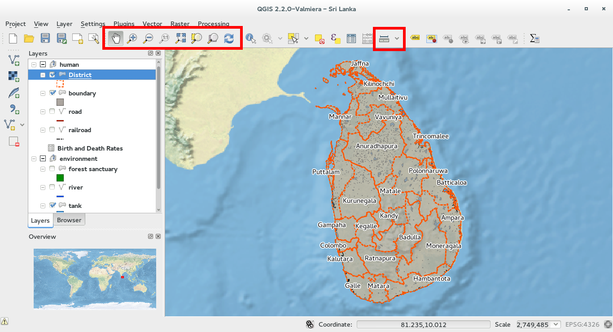
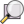
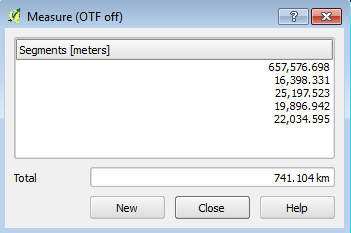
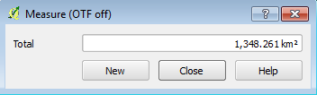

Basics around the map [3.2]
===========================

Pan and zoom the map
----------------------------------------------

All the layer displayed in the map view can easily panned, zoomed in and out thanks to toolbar dedicated buttons.

You must always click on the corresponding button and then you can perform the operation with the mouse (e.g. zoom in and zoom out)

Here a complete list of the buttons and icons: Pan the map |pan|, Zoom in |zoomin|, Zoom out |zoomout|, Last zoom |lastzoom|, Next Zoom |nextzoom|, Zoom to layer |zoomtolayer|, Zoom to selecion |zoomtoselection| 

.. |pan| image:: img/mActionPan.png
		:width: 1.5em

.. |zoomin| image:: img/mActionZoomIn.png
		:width: 1.5em

.. |zoomout| image:: img/mActionZoomOut.png
	:width: 1.5em

.. |lastzoom| image:: img/mActionZoomLast.png
	:width: 1.5em

.. |nextzoom| image:: img/mActionZoomNext.png
	:width: 1.5em

.. |zoomtoselection| image:: img/mActionZoomToSelected.png
	:width: 1.5em

You can also use the scroll wheel for much of the same commands.

Measure length and areas
---------------------------------------------------------

* **Points**

QGIS is able to measure real distances between given points. Click on the |mActionMeasure| button and then click on the map to start the measurement. Each segment-length as well as the total will be showed up in the measure dialog-window. To stop measuring click your right mouse button.

|

* **Areas**

Areas can also be measured by clicking the |mActionMeasureArea| button. In the measure window the accumulated area size appears.

.. |mActionMeasure| image:: img/mActionMeasure.png

.. |mActionMeasureArea| image:: img/mActionMeasureArea.png
