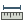

.. |mActionMeasureArea| image:: img/mActionMeasureArea.png

3.2 Basics around the map
==========================

Pan and zoom the map
----------------------------------------------

All the layer displayed in the map view can easily panned, zoomed in and out thanks to toolbar dedicated buttons.

You must always click on the corresponding button and then you can perform the operation with the mouse.

**Here a complete list of the buttons and icons:**

.. figure:: img/mActionPan.png

	Pan the map

.. figure:: img/mActionZoomIn.png

	Zoom in

.. figure:: img/mActionZoomOut.png

	Zoom out

.. figure:: img/mActionZoomLast.png

	Goes to the last zoom

.. figure:: img/mActionZoomNext.png

	Goes to the next zoom

.. figure:: img/mActionZoomToLayer.png

	Zooms to the layer you have selected

.. figure:: img/mActionZoomToSelected.png

	Zooms to the selection

.. figure:: img/mActionZoomToSelected.png

Measure length and areas
---------------------------------------------------------

* **Points**
QGIS is able to measure real distances between given points. Click on the |mActionMeasure| button and then click on the map to start the measurement. Each segment-length as well as the total will be showed up in the measure dialog-window. To stop measuring click your right mouse button.

.. figure:: img/map_tools_3.png
	:align: center

* **Areas**
Areas can also be measured by clicking the |mActionMeasureArea| button. In the measure window the accumulated area size appears.

.. figure:: img/map_tools_4.png
	:align: center
