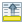
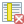
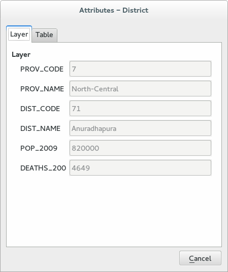

.. |mActionLabeling| image:: img/mActionLabeling.png 

.. |mActionIdentify| image:: img/mActionIdentify.png 
		:width: 1.5 em 

.. |mActionOpenTable| image:: img/mActionOpenTable.png 

.. |mActionToggleEditing| image:: img/mActionToggleEditing.png

.. |mActionUnselectAttributes| image:: img/mActionUnselectAttributes.png

.. |mActionInvertSelection|  image:: img/mActionInvertSelection.png
.. |mActionCopySelected| image:: img/mActionCopySelected.png
.. |mActionZoomToSelected| image:: img/mActionZoomToSelected.png
.. |PanToSelected| image:: img/PanToSelected.png 

.. |mActionNewAttribute| image:: img/mActionNewAttribute.png

.. |mActionCalculateField| image:: img/mActionCalculateField.png

.. |mActionMapTips| image:: img/mActionMapTips.png

Querying the map [3.3]
========================

Labeling 
-------------

The |mActionLabeling| Labels core application provides smart labeling for vector point, line and polygon layers and only requires a few parameters.  

You can access to the label menu by clicking on the |mActionLabeling| toolbar button: 

or through the **Properties menu** of the layer you want to label (just double click on it) and then select the **labels** tab of the dialog window: 

 .. figure:: img/querying_the_map_2.png
	:align: center
	:scale: 70%

First step is to activate the checkbox **Label this layer with** checkbox and select an attribute column from the drop down menu to use for labeling and click **OK**: 

 .. figure:: img/querying_the_map_3.png
	:align: center
	:scale: 70%

If you want to perform more fancy labels you have a lot of options in the label dialog windows: 

* **Text**: changes the font, the dimension, the color and other features related with the text 
* **Formatting**: allows to align the text or choose the decimal places (the label is numeric) 
* **Buffer**: draws a buffer around the text 
* **Background**: draws a shaped background beyond the label 
* **Shadow**: draws a shadow around the text 
* **Placement**: manages label placement and the labeling priority 
* **Rendering**: defines label and feature options
 
 .. figure:: img/querying_the_map_4.png
	:align: center
	:scale: 50%

Feature count 
--------------------

QGIS has an easy way to count the feature of the polygons. Just click with the right button on the layer you want to count the features of and activate the checkbox **Show Feature Count**. You can now see in square brackets the feature count: 

 .. figure:: img/querying_the_map_5.png
	:align: center
	:scale: 70%

Be aware that the feature count depends directly on the classification of the polygon! 

Feature information 
----------------------------

Identify features 
........................

Identify features allows to interact with map canvas to get data attribute on a pop-up windows. To identify feature click on the |mActionIdentify| icon in the toolbar and then click on the feature in the map canvas. 
In the pop-up window you can see each attribute of the clicked feature:

Working with the attribute table 
.....................................................

The attribute table displays features of a selected layer. Each row in the table represents one map feature and each column contains a particular piece of information about the feature. Features in the table can be searched, selected, moved or even edited. 
Select the layer you want to see the attribute table and click on the |mActionOpenTable| icon. Alternatively you can rightclick on the layer and choose |mActionOpenTable| from the dropdown menu: 

 .. figure:: img/querying_the_map_6.png
	:align: center
	:scale: 70%

This will open a new window which displays the feature attributes of the layer. 

 .. figure:: img/querying_the_map_7.png
	:align: center
	:scale: 50%

Each **row** in the attribute table displays the attributes of the corresponding **feature** in the layer. If the set of features selected in the main window is changed, the selection is also updated in the attribute table. Likewise, if the set of rows selected in the attribute table is changed, the set of features selected in the main window will be updated. 

Rows can be selected by clicking on the row number on the left side of the row. Multiple rows can be marked by holding the **Ctrl** key. A continuous selection can be made by holding the **Shift** key and clicking on several row headers on the left side of the rows. 

The table can be sorted by any column, by clicking on the column header. A small arrow indicates the sort order (downward pointing means descending values from the top row down, upward pointing means ascending values from the top row down). 

Filtering and Searching 
~~~~~~~~~~~~~~~~~~~~~~~

Through the attribute table windows you can easily search and filter attributes of the the columns. Choose **Column filter** from the menu in the bottom left corner. Select the field (column) from which the search should be performed from the dropdown menu and hit the **Apply** button. Then only the matching features are shown in the Attribute table: 

 .. figure:: img/querying_the_map_8.png
	:align: center
	:scale: 70%

The following image shows an example of *Western* filtering of the *ADM1_NAME* column. Be aware at the case sensitive checkbox in the bottom right corner (if activated the filtering is sensitive to upper or lower letters): 

 .. figure:: img/querying_the_map_9.png
	:align: center
	:scale: 70%

Finally, the toolbar of the attribute table dialog window has several buttons, here the list an the functionalities:

* |mActionToggleEditing| :sup:`Toggle editing mode` to edit single values 
  and to enable functionalities described below  
* |mActionSaveEdits| :sup:`Save Edits` 
* |mActionUnselectAttributes| :sup:`Unselect all` 
* |mActionSelectedToTop| :sup:`Move selected to top` 
* |mActionInvertSelection| :sup:`Invert selection` 
* |mActionCopySelected| :sup:`Copy selected rows to clipboard` 
* |mActionZoomToSelected| :sup:`Zoom map to the selected rows` 
* |mActionDeleteSelected| :sup:`Delete selected features` 
* |mActionNewAttribute| :sup:`New Column` 
* |mActionDeleteAttribute| :sup:`Delete Column` 
* |mActionCalculateField| :sup:`Open field calculator` 

Get info gliding layers 
...................................

With the |mActionMapTips| icon in the upper toolbar of QGIS you can see some layer information just gliding the map with the mouse. To set what you want to display, click on the layer and select the **Display** tab. 
You can now choose the layer attribute you want to see the information: to change it, just click the dropdown menu and select another attribute: 

 .. figure:: img/querying_the_map_10.png
	:align: center
	:scale: 70%

Summary info for area 
.................................

You can easily obtain statistical information of a layer through the plugin **Statist**. Open the plugin by clicking on **Vector -> Statist menu**. 

 .. figure:: img/querying_the_map_11.png
	:align: center
	:scale: 70%

The dialog window of **Statist** is made up by 3 main parts: 

1. layer and field choice
2. results window
3. plot window

 .. figure:: img/querying_the_map_13.png
	:align: center
	:scale: 80%

In the first part, choose the layer from the dropdown menu **Input vector layer** you want to display the statistics of: the dropdown menu shows all the layer of the map canvas. 
From the **Target field** dropdown menu choose the attribute table field of the layer you have chosen: the plugin **Statist** detect automatically the numeric field, but you can also perform statistics of text fields. In this case, activate the checkbox **Enable statistics for text fields**. 

Once you have done click on **OK**. 

In the second part of the dialog windows you can see basic summary statistics of the chosen field, these include: 

* Count: the features number of the layers 
* Unique values: how many unique values are present in the field 
* Minimum value: the minimum value of the field  
* Maximum value: the maximum value of the field 
* Range: the range between the maximum and the minimum value  
* Sum: sum of all the values 
* Mean value: the mean value   
* Median value: the median value  
* Standard deviation: the standard deviation  
* Coefficient of Variation: a normalized measure of dispersion (defined as the ratio of the standard deviation to the mean) 

In the third part of the dialog windows it is displayed the plot of to attribute field and there are several option you can choose such as the plot title, the bar scale format (linear or logarithmic), the axes limits and you can save the plot as external file (image or pdf). 
