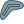
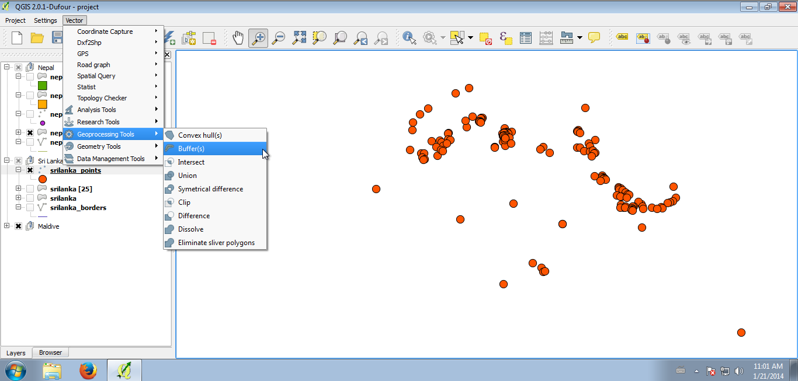
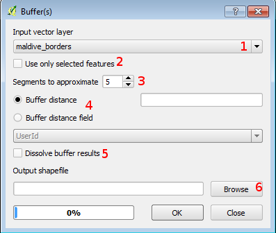
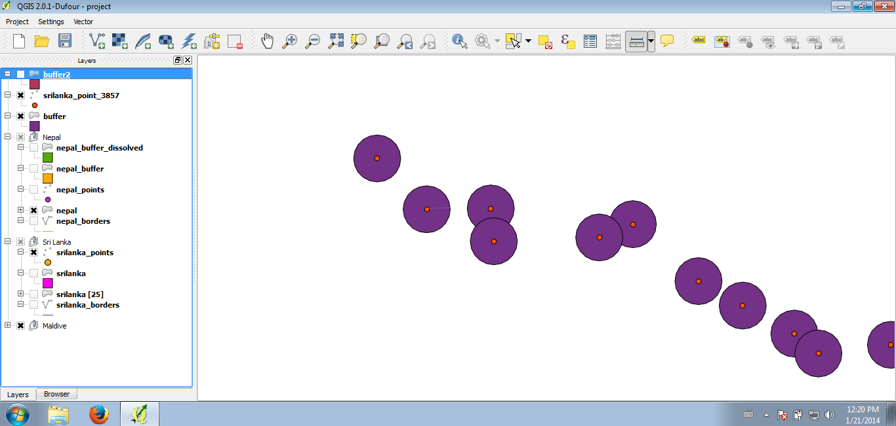
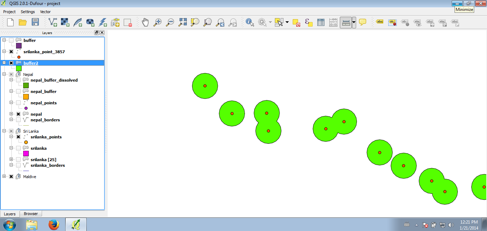

3.4 Buffers
===========

Performing buffers in QGIS is very simple and intuitive. To open the buffer dialog window click on the |buffer| icon **Vector -> Geoprocessing tolls -> Buffer(s)**:

You should now see the buffer dialog window where you can perform your operation:

1. Select the layer from the drop down menu (all layer of your QGIS project are available)

2. You can click on the checkbox **Use only the selected features** if you want that buffers are created only for the selection

3. Choose the segment to approximate (default value is fine)

4. You can type a distance for the buffer or select an attribute table field that contain this distance (be aware that the default measurement unit are meters!)

5. Click on the checkbox **Dissolve buffer results** if you want to dissolve all the buffers. This means that each buffer will be *melt* with the others creating a unique geometry. 

6. Browse in your computer for a name of your buffer (actually the buffer you are creating is a new layer)

7. Click on **OK**

8. Once the process is finished, click on **Yes** to add the new buffer layer to the map canvas

.. note:: buffers are layers, so you can perform all the operations like other layers (selection, query, filtering...)

The following screenshots show the difference between *normal* and *dissolved* buffers:

**normal buffers**

**dissolved buffers**

.. warning:: if you dissolve the buffers the related attribute table looks differently!
