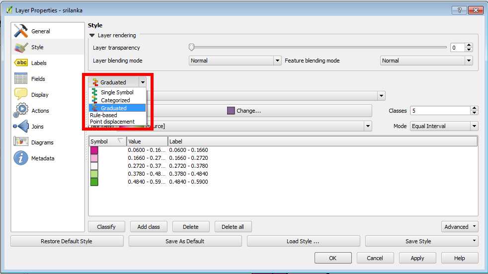
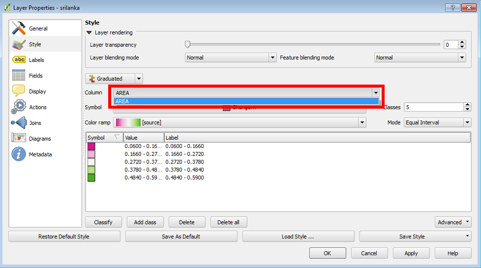
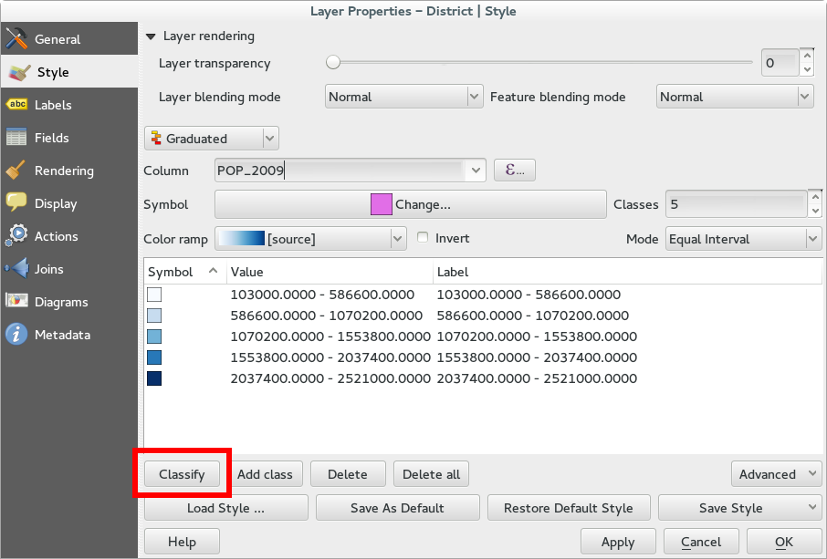
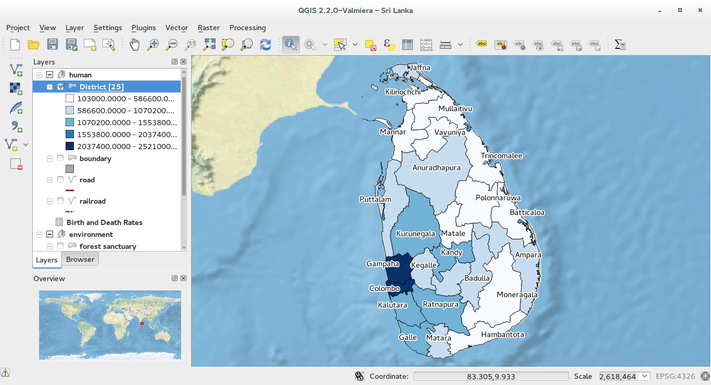
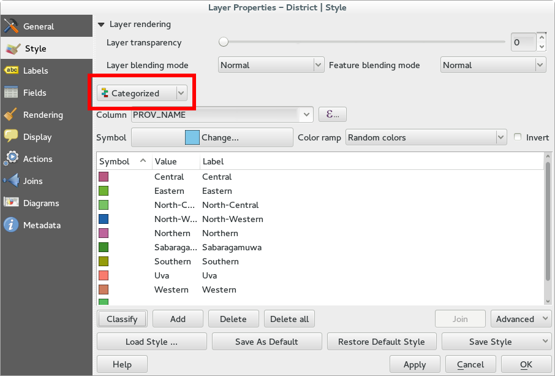
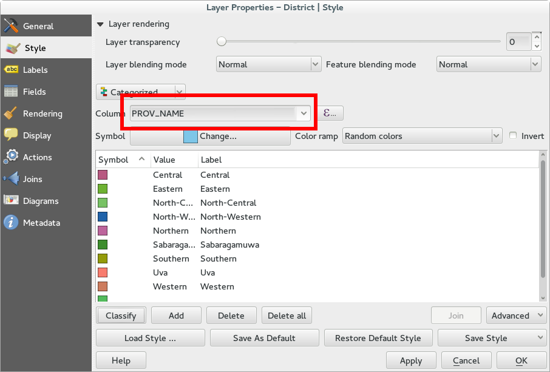
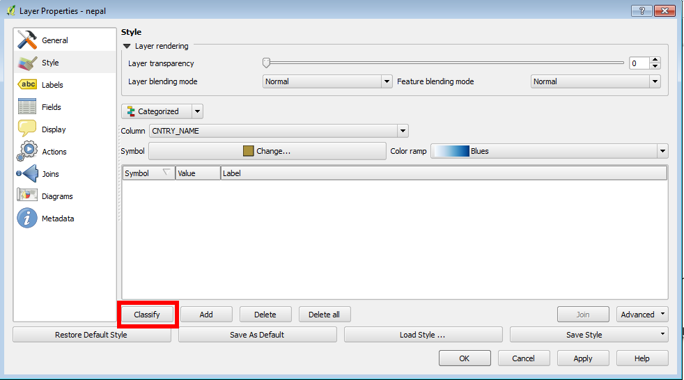
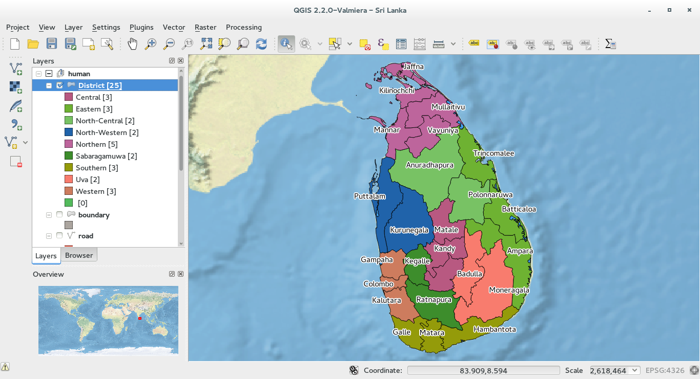

3.6 Thematic maps 
======================

Thematic maps production is a very with QGIS. Depending on the attribute table related to the layer you can easily create several map types. 
First of all you open the **Properties** menu of the layer you want to create the map, double clicking on it or right clicking and then choosing *Properties*. 
Now move to the **Style** tab: all the layer stylization are linked to this tab. 

Graduated color
-----------------------------

To create a graduated color map, open the **Properties** menu as described above and choose **Graduated** from the drop-down menu: 

Now you have to choose a numeric field from the attribute table in order to create classes and link them to a specific color. The drop down menu shown in the next figure shows all the available column of the attribute table. In the following example, the layer has an attribute that describes the area of each features in square degrees: 

You can choose a color ramp (or create one) and you can also customize the classification deciding the number of classes and the mode of classification. 
Once done click on **Classify**. 

This is the result:

Unique value
-----------------------------

In QGIS **unique value** classification is known as **Categorized** and you can access it from the drop down menu. 
In the following example we have classified Nepal depending on its counties. 

To make this classification, choose **Categorized** from the drop down menu and then choose the field attribute table you want to perform the categorization (*ADM1_Name* in this example)

|
|

Choose the color (many other customization are available) and click on **Classify**. Then close the windows clicking on **OK**.  

The result is:

