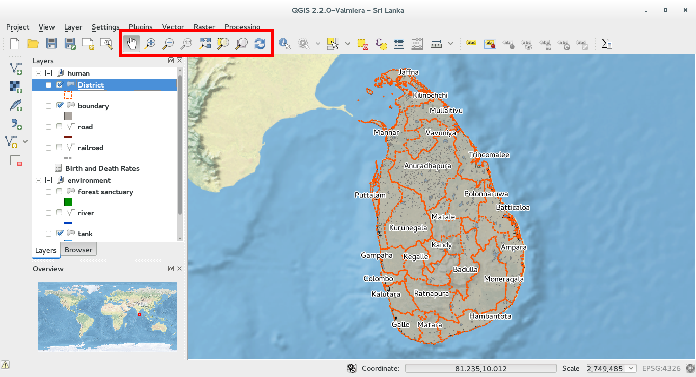

First steps with QGIS
=========================

We have created a first simple project so you can explore and make some practice with QGIS.

First of all, load the project:

* click on **Open...** in the **Project** menu or click on the folder icon in the menu bar. Browse for the file **project.qgs**

When the project has been loaded you will see some changes in the graphical interface of QGIS. It is divided in **4 main areas**:

in particular:

1. **Menu bar**
2. **Toolbar**
3. **Map legend**
4. **Map view**

Menu bar
---------------------

The menu bar provides access to various QGIS features using a standard hierarchical menu.

Toolbar
------------------

The toolbar provides access to several tools for interacting with the map such as: pan - zoom the map, select features, load new layers, label the layer...

Each toolbar item has popup help available. Hold your mouse over the item and a short description of the tool’s purpose will be displayed.

Every menubar can be moved around according to your needs. Additionally, every menubar can be switched off using your right mouse button context menu holding the mouse over the toolbars.

Map legend
--------------------------

The map legend area lists all the layers in the project. The checkbox in each legend entry can be used to show or hide the layer.

A layer can be selected and dragged up or down in the legend to change the z-ordering. Z-ordering means that layers listed nearer the top of the legend are drawn over layers listed lower down in the legend.

Layers in the legend window can be organized into **groups**:

* Right click in the legend window and choose **Add Group**. Type in a name for the group and press Enter. Now click on an existing layer and drag it onto the group (in the example project provided, there are three groups, each one corresponds to a State)

Map view
----------------------
All the maps are displayed in this area. The map displayed in this window depend on the layers you have chosen to load (wheter the checkbox for the layer is activated or not).
The map view can be panned (shifting the focus of the map display to another region) and zoomed in and out thanks to the toolbar buttons.

	
