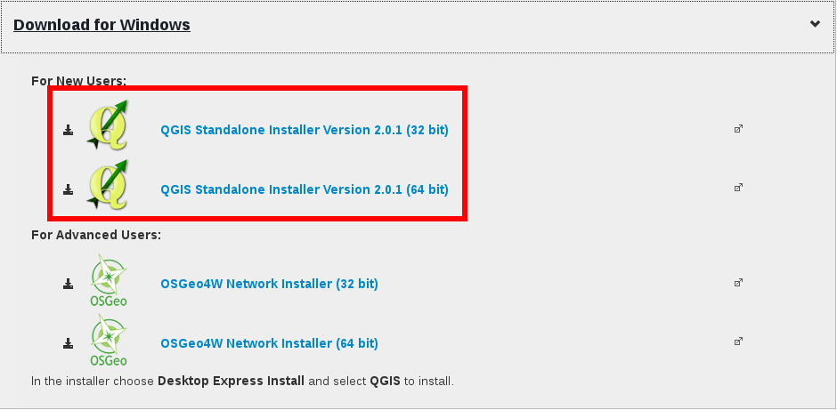
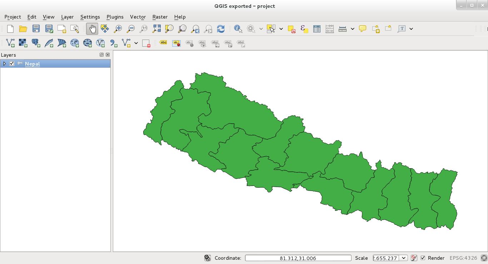
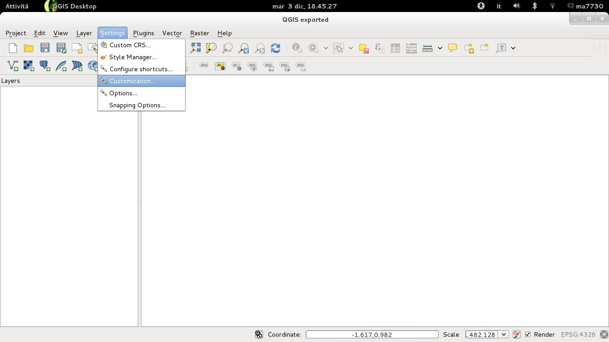
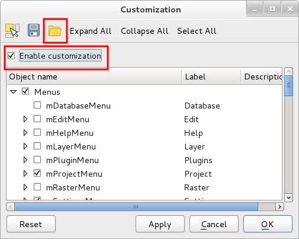
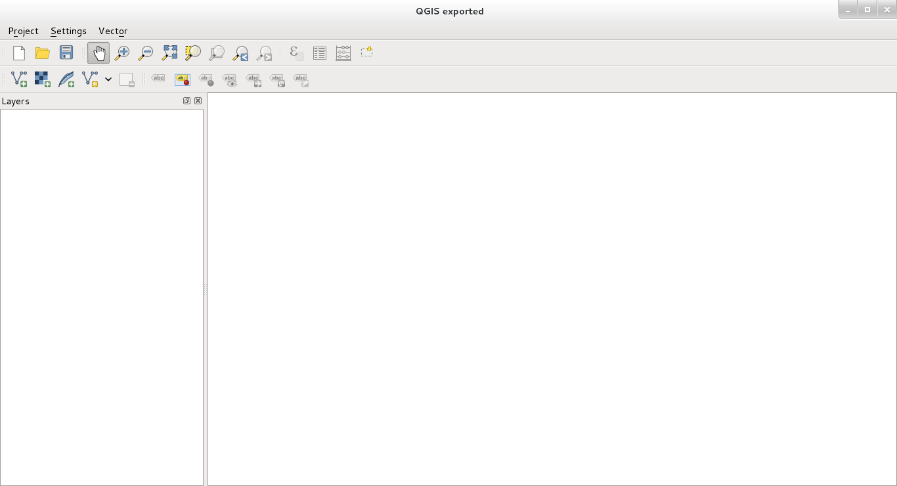

.. |qg| image:: img/logo.png
	:scale: 60%

INSTALL QGIS AND CUSTOMIZE THE TOOLBAR
==========================================

In order to use QGIS you should first go on the `QGIS website <http://www.qgis.org/en/site/forusers/download.html#windows>`_ and download the **QGIS Standalone version**.
Be careful to choose the right version for you computer (32 or 64 bit).

Once the download is finished, just double click on the file and follow the instruction of the wizard.

.. inserire le immagini del wizard per windows

At the end of the installation there are two new program available on your computer, **QGIS Desktop** and **QGIS Browser**.

RUN QGIS DESKTOP
-------------------------------------
To run QGIS Desktop just double click on the icon |qg|. You should see something like:

	
	**overview of QGIS**

As you can see there are a lot of button in the upper toolbar. You can easily customize it in order to display only the required button and have a cleaner view of the graphical interface.

Just load the file we have created in order to have a better QGIS view:

1. click on the menu **Settings**

2. enable the checkbox **Enable Customization**. Click on the folder icon and browse in your computer for the **configuration.ini** file that we have provided.

3. Once you have loaded the file, click on **Apply** then on **OK** and close QGIS. When you restart QGIS, the view is changed and it looks like:

