.. |qg| image:: img/logo.png
	:scale: 40%

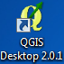

Install QGIS and customize the toolbar
==========================================

In order to use QGIS you should first go on the `QGIS website <http://www.qgis.org/en/site/forusers/download.html#windows>`_ and download the **QGIS Standalone version**.
Be careful to choose the right version for you computer (32 or 64 bit).

.. image:: img/win_installer.png
	:align: center

Once the download is finished, just double click on the file and it will open a wizard.

* Click **Next** in the first window and **I Agree** in the second one:

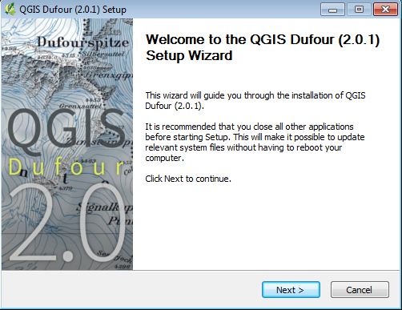

|
|

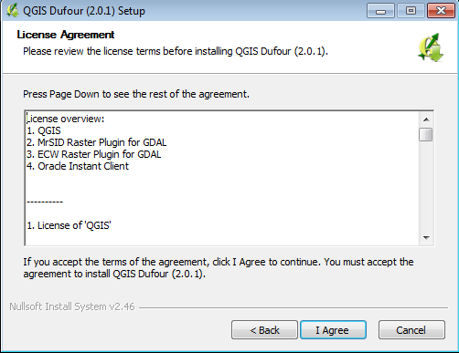

* you can decide the path where to install QGIS (the default choice is good)

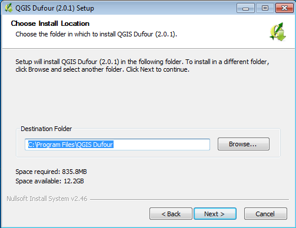

* you can download sample dataset for training (just click on **Next** whitout tickling any checkbox)

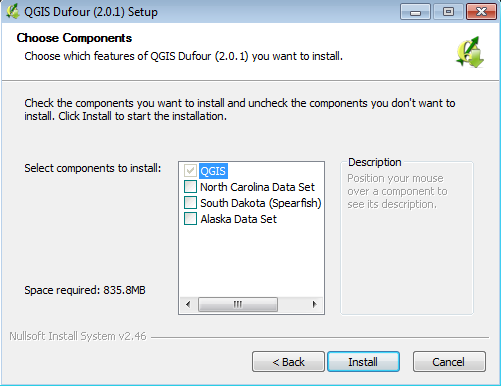

* wait till the installation ends (it will take some minutes) and then click on **Finish**

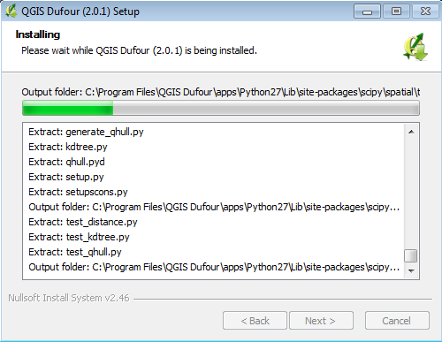

|
|

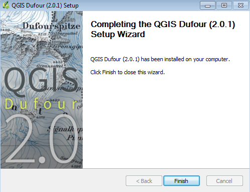

.. inserire le immagini del wizard per windows

At the end of the installation there will be some new icons on your desktop: **QGIS Desktop** is one of them.

RUN QGIS DESKTOP
-------------------------------------
To run **QGIS Desktop** just double click on the icon |qgd|. After a few seconds the software is ready: it will appear a window of tips and tricks (just click on the checkbox so this window won't appear anymore) and the first QGIS view should be something like:

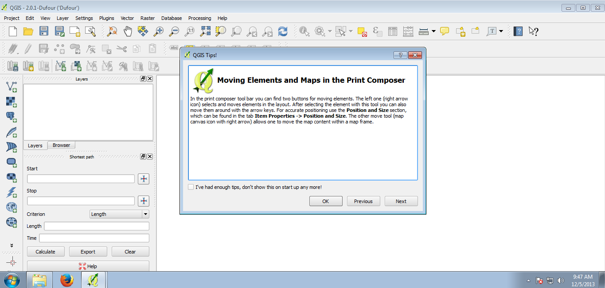
	
	**QGIS overview**

As you can see there are a lot of button in the upper toolbar and a bunch of menu available. You can easily customize it in order to display only the required button and have a cleaner view of the graphical interface.

In order to do that, you should:

1. click on the menu **Settings**

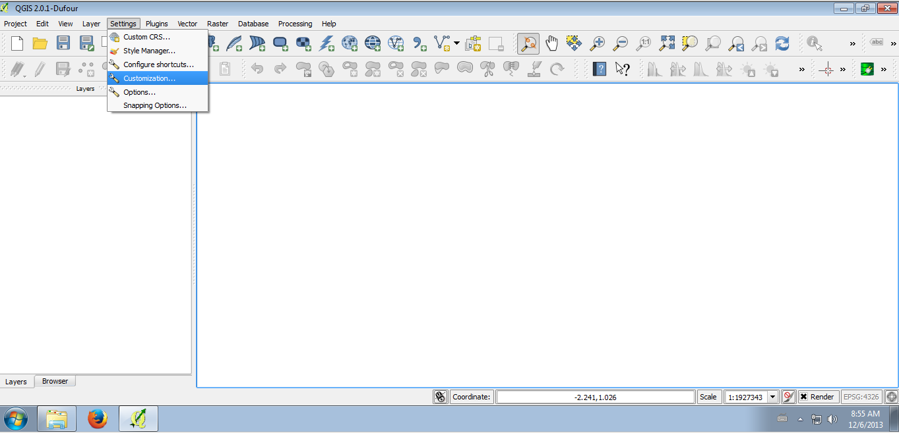

2. activate the checkbox **Enable Customization**. Click on the folder icon and browse in your computer for the **configuration.ini** customization file we have created for you. 

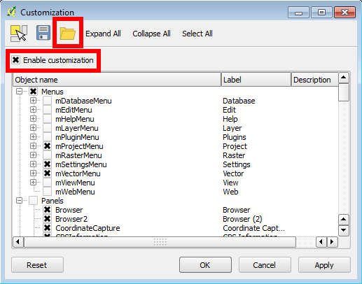

3. Once the file has been loaded, click on **Apply** then on **OK** and close QGIS (customization requires restart of the program). When you restart QGIS, the view is changed and it looks like:

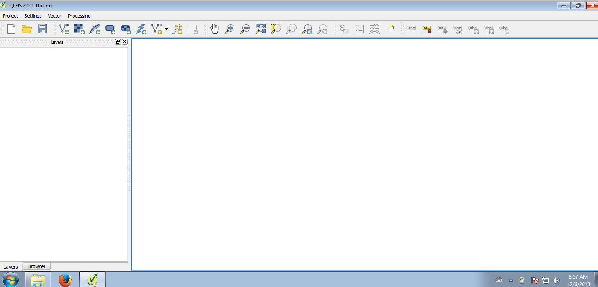

|

If you don't like the button disposition you can easily move them with a simply drag and drop operation.
