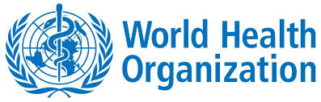

QGIS Health Mapping Tool
=============================

.. image:: img/logo.png
	:scale: 130%
	:align: right

|
|
|
|
|
|
|
|

Description of the project
-----------------------------------------

Mapping tool technologies and softwares can be very helpful for the data management of diseases such as Malaria, HIV/AIDS, Polio, etc...

The Health Mapping tool has been created thanks to a deep customization of the open-source software QGIS.

Aim of the software is to offer a quick and easy way of visualizing data and creating thematic maps for public health purposes. For this reason, the graphical user interface (GUI) has been strongly customized and simplified, but it still provides all the functionalities for the data handling and map creation.

All the standard data formats are supported and they can easily imported and converted in other format if required.

The tool provides also the possibility of saving the projects so they can be loaded by administrators in a second time.
