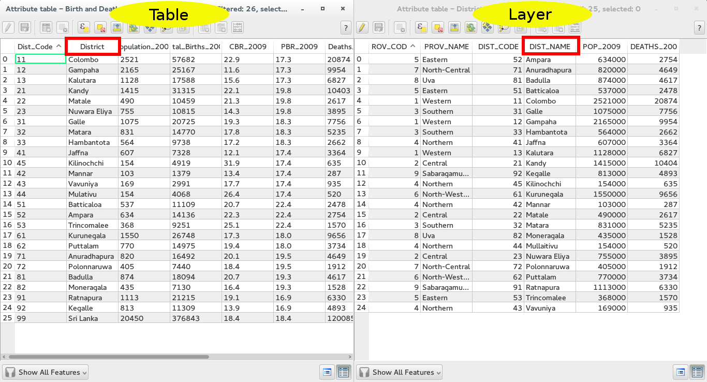
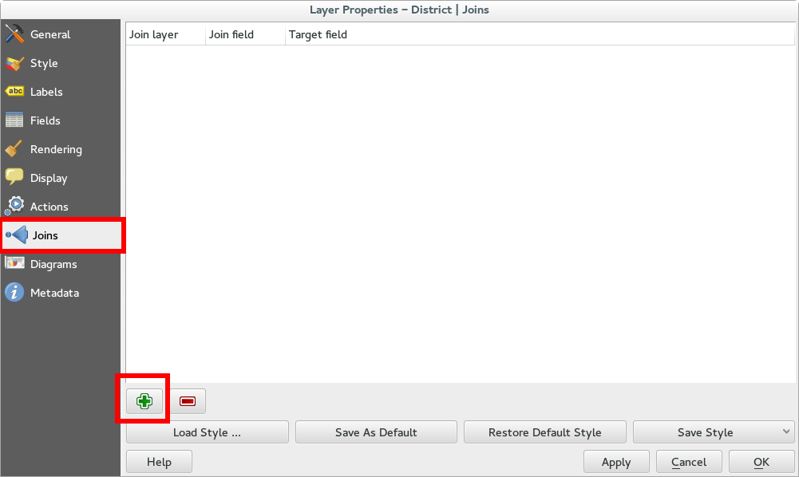
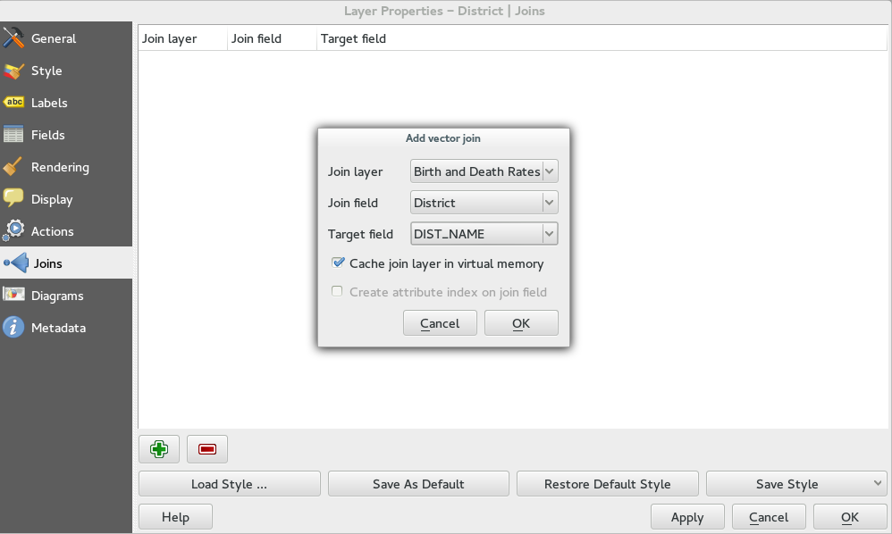
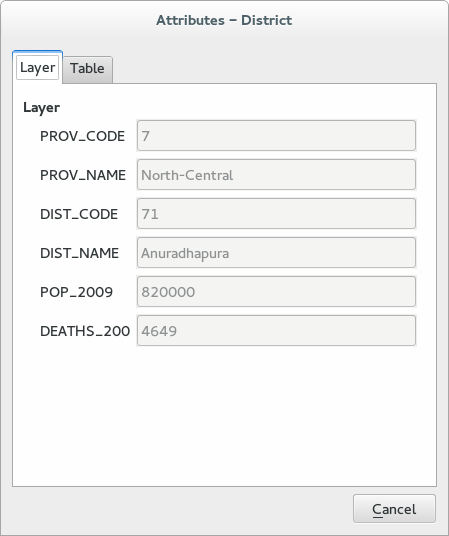

.. |mActionIdentify| image:: img/mActionIdentify.png
	:width: 1.5 em 

Join layers by attribute
========================

With QGIS it is very simple to join layers and/or table with a common field.

First thing you should do is to have a look at the attribute tables of the layer you want to join in order to know the common attribute column.

In this specific case we want to join a table *Birth and Death Rates* with the *District* layer. 
Common fields, as shown in the following pictures, are:

* **District** for the *Birth and Death Rates* table
* **DIST_NAME** for the *District* layer

To join the layers, open the **Properties** window of the *District* by double clicking on it (or right click and browse for Properties) and go on the **Joins** tab.

Now click on the green **+** button: QGIS will ask you which is the layer you want to join and what are the fields.

* **Join layer** is the *Birth and Death Rates* table
* **Join field** is the field of the table
* **Target field** is the field of the *District* layer

Once you have done, click on **OK** and the join operation is listed in the window. 
Now, if you open the attribute table of the *District* layer you will see that QGIS has added all the attribute of the *Birth and Death Rates* table.

Furthermore, through the |mActionIdentify| button you can get all the information of the layer and those of the joined table. 
Select the layer *District* from the layer list and click on |mActionIdentify| button. If you click on a feature of the selected layer, a dialog window will open. These window in divided in 2 tabs: the first (*Layer*) contains the attribure of the layer itself while the second tab (*Table*) shows the attributes of the joined table.

	

.. note:: you can save the layer together with the joined table as a new layer. This way the attribute table of the new layer will keep all the attributes.
