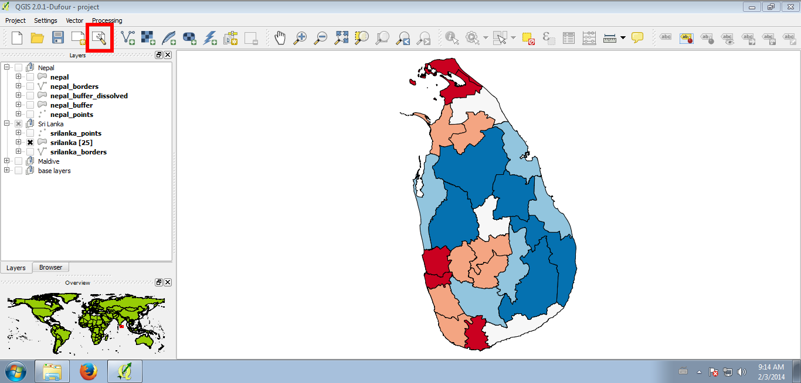
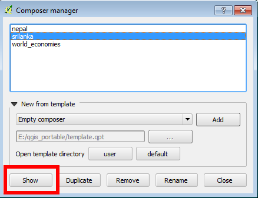
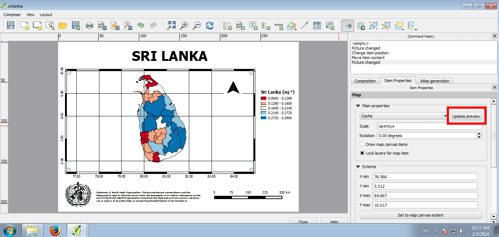
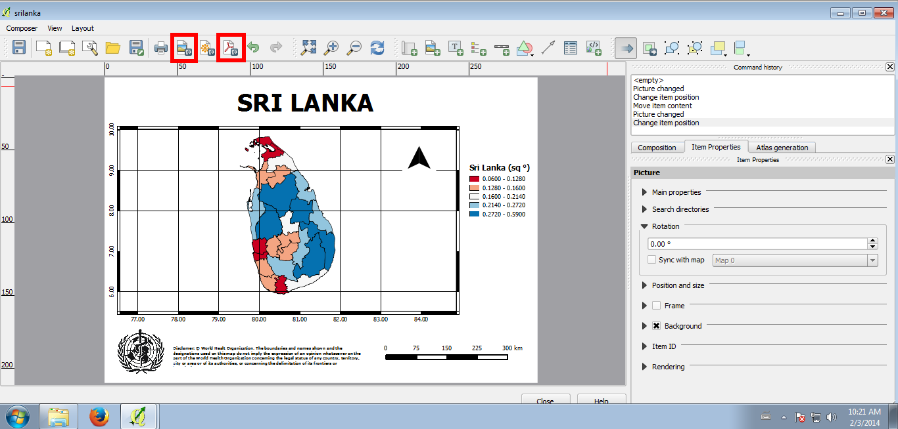

.. |mActionComposerManager| image:: img/mActionComposerManager.png
	:width: 1.5em
.. |mActionSaveAsPDF| image:: img/mActionSaveAsPDF.png
	:width: 1.5em
.. |mActionSaveMapAsImage| image:: img/mActionSaveMapAsImage.png
	:width: 1.5em

Print composer
===============

Map layout creation is a very simple procedure with QGIS. We prepared print layout of some layer of the example project: they are all customizable, but for now just focus on how to get them.
Layout preparation will be developed in the :ref:`print_composer_advanced`.

To access to all the layout we prepared click on the |mActionComposerManager| toolbar button:

The small dialog box that will open and it lists all the print layout available. Just select an item and click on **Show**.

The **Print composer** window will open and you can see the map ready to be printed. Through the print composer window you have access to a lot of functions, but for now just focus on how to save the layout as image or pdf.

.. note:: if none map is shown just update the layout view clicking first on the grid and then on the **Update item** on the right side of the window.

To save the map click on the |mActionSaveMapAsImage| button to save the layout as image, several formats are available (png, jpg, bmp...) or on the |mActionSaveAsPDF| button to save it as pdf. 
In both cases just choose the path where to save the layout and it will be available on your computer.

For more information about layout customization, refer to :ref:`print_composer_advanced`.
