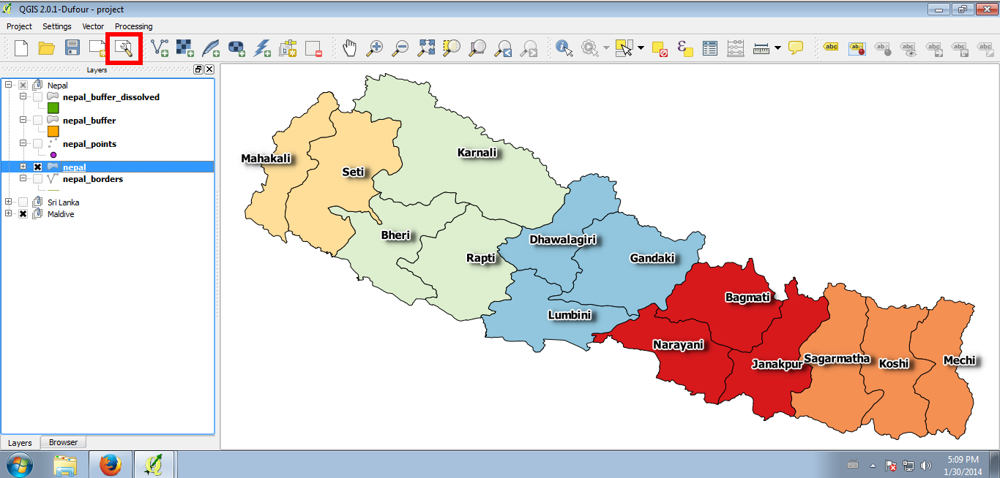
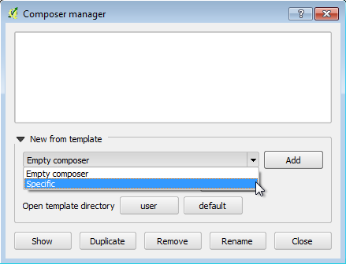
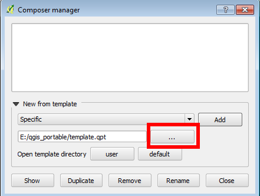
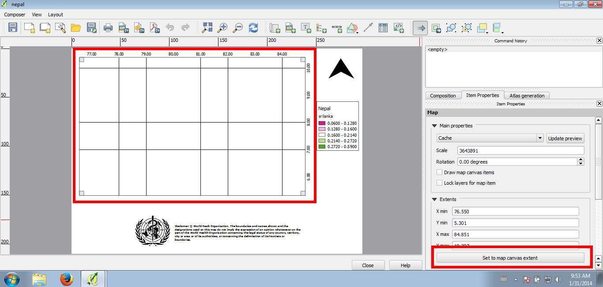
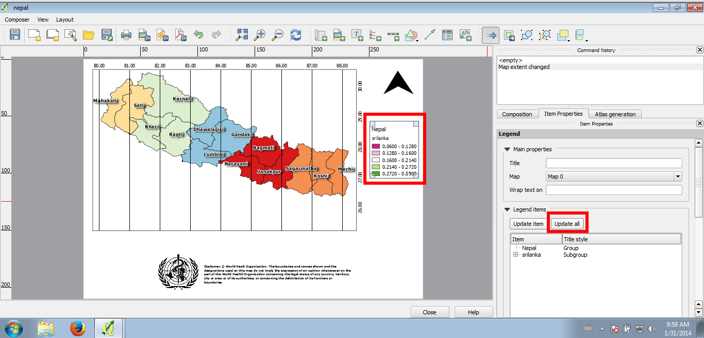
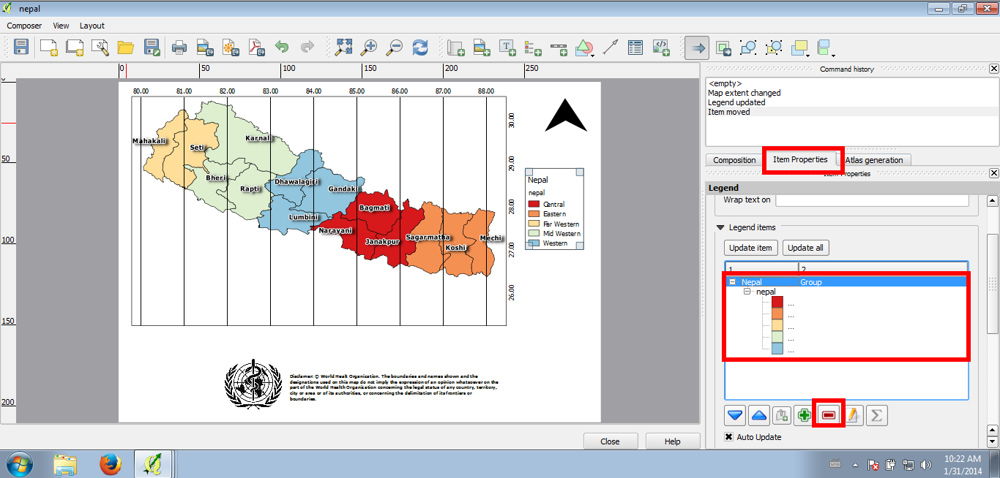
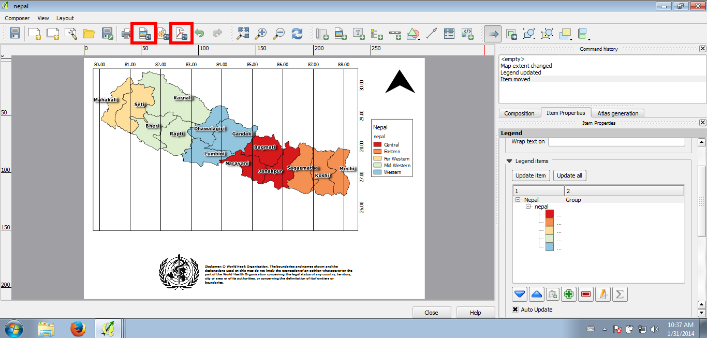

.. |mActionSaveAsPDF| image:: img/mActionSaveAsPDF.png
	:width: 1.5em
.. |mActionSaveMapAsImage| image:: img/mActionSaveMapAsImage.png
	:width: 1.5em

..  _print_composer_advanced:

Print composer (advanced)
=================================

With QGIS you can create strongly customizable print layout of layers that are loaded into the map canvas. 
The QGIS print composer is a very powerful tool with a lot of option, but don't worry, we have created a simple template and with just a few clicks you will have the map you desired.

To access to the print composer click on the toolbar |mActionComposerManager| button:

A new dialog window will open. Click on the dropdown menu and choose **Specific**: this allows you to load the template we prepared.

Then click on the **...** button and browse in your computer for the file **template.qpt** (we put the file in the same directory of the other layers):

Now click on the **Add** button and give a name to your map. When you click on **OK** the print composer window will open, so click on **Close** and go to the new window.

Through the print composer window you have access to a lot of options: move and edit items, add objects, pictures and labels, resize maps and much more. In order to get a simple and effective print layout a few steps are required:

* click on the map and then on the **Set to map canvas extent** button. This way you will update the extent and the view inside the map.

.. note:: the button **Set to map canvas extent** means that the map extent will be updated on the size of the QGIS map canvas window.

.. note:: don't worry about the map grid: even if it looks strange and incomplete, there will be no problem when saving the layout as image or pdf.

Once that you updated the map extent, you have also to update the legend. To do this, select the legend just clicking on it and then click on the **Update all** button.

.. warning:: if you see that in the legend are more object than those you want, it is possible that other layers are selected in the QGIS map canvas. So just go back to QGIS, unselect all the layer and click again on the **Update all** button. Another strategy is to remove manually each object.

To edit the Legend:

* click on the Legend
* click on the **Item Properties**
* select the object you want to remove in the menu
* click on the |symbologyRemove| button

Once sure that the print layout is want you are looking for you can save it as image or as pdf. To do this click on the |mActionSaveMapAsImage| button to save the layout as image, several formats are available (png, jpg, bmp...) or on the |mActionSaveAsPDF| button to save it as pdf.
In both cases just choose the path where to save the layout and it will be available on your computer.

 
