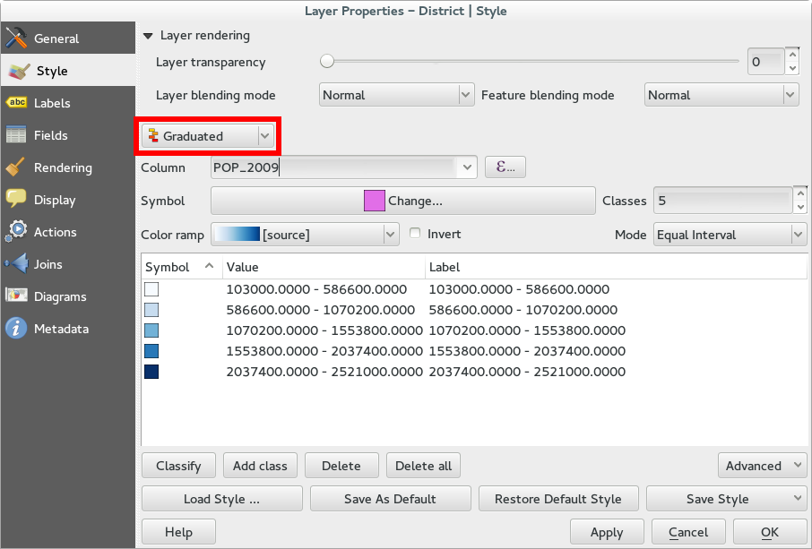
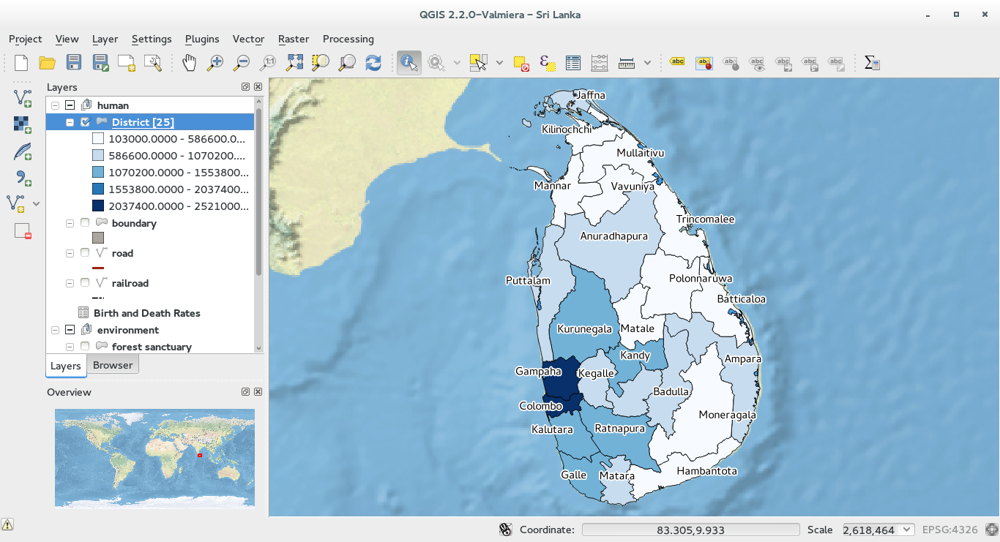
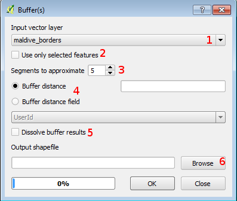

QGIS features implementation
=============================

Thematic maps
-------------------------

Thematic map production is a very simple task with QGIS. Depending on the attribute table related to the layer you can easily create several types of maps.
First of all you open the **Properties** menu of the layer either double clicking on it or right clicking and then choosing Properties.
Now move to the **Style** tab: all the layer stylization are linked to this tab.

* **Graduated color**

To create a graduated color map, open the **Properties** menu as described above and choose **Graduated** from the drop-down menu:

Now you have to choose a numeric field from the attribute table in order to create classes and link them to a specific color. The drop down menu shown in the next figure shows all the available column of the attribute table. In the following example, the layer has an attribute that describes the area of each features in square degrees:

.. figure:: img/graduated_2.png
	:align: center
	:scale: 70%

You can choose a color ramp (or create one) and you can also customize the classification deciding the number of classes and the mode of classification.
Once done click on **Classify**.

.. figure:: img/graduated_3.png
	:align: center
	:scale: 70%

This is the result:

* **Unique value**

In QGIS **unique value** classification is known as **Categorized** and you can access it from the drop down menu.
In the following example we have classified Nepal depending on the geographical location of its counties.

To make this classification, choose **Categorized** from the drop down menu and then choose the field attribute table you want to perform the categorization (ADM1_Name in this example)

.. figure:: img/categorized_1.png
	:align: center
	:scale: 70%

|
|

.. figure:: img/categorized_2.png
	:align: center
	:scale: 70%

Choose the color (many other customization are availables) and click on **Classify**. Then close the windows clicking on **OK**.

.. figure:: img/categorized_3.png
	:align: center
	:scale: 70%

The result is:

.. figure:: img/categorized_4.png
	:align: center
	:scale: 70%

Map tools
----------------

All the layer displayed in the map view can easily panned, zoomed in and out thanks to toolbar dedicated buttons.

You must always click on the corresponding button and then you can perform the operation with the mouse.

In particular:

.. figure:: img/mActionPan.png
	:width: 1.5em

	Pan the map

.. figure:: img/mActionZoomIn.png
	:width: 1.5em

	Zoom in

.. figure:: img/mActionZoomOut.png
	:width: 1.5em

	Zoom out

.. figure:: img/mActionZoomLast.png
	:width: 1.5em

	Goes to the last zoom

.. figure:: img/mActionZoomNext.png
	:width: 1.5em

	Goes to the next zoom

.. figure:: img/mActionZoomToLayer.png
	:width: 1.5em

	Zooms to the layer you have selected

.. figure:: img/mActionZoomToSelected.png
	:width: 1.5em

	Zooms to the selection

Buffers creation
------------------------

With QGIS you can create buffers around any layer (point, line and polygon).
To create a buffer, click on **Vector** menu in the upper bar, then select **Geoprocessing tools** and click on **Buffer(s)**.

You should now see the buffer window where you can perform your operation:

1. Select the layer from the drop down menu (all layer of your QGIS project are available)

2. You can click on the checkbox **Use only the selected features** if you want that buffers are created only for the selection

3. Choose the segment to approximate

4. You can type a distance for the buffer or select an attribute table field that contain this distance

5. Click on the checkbox **Dissolve buffer results** if you want to dissolve all the buffers

6. Browse in your computer for a name of your buffer (actually the buffer you are creating is a new layer)

Layer overlay
----------------------

QGIS follows the "z-order": it means that it will be displayed the active layer that is placed above all the other active layers.

You can easily activate/deactivate layers by clicking on the checkbox next to them and you can move them simply by drag and drop.

The following images show the differences between to layer order:

|
|

